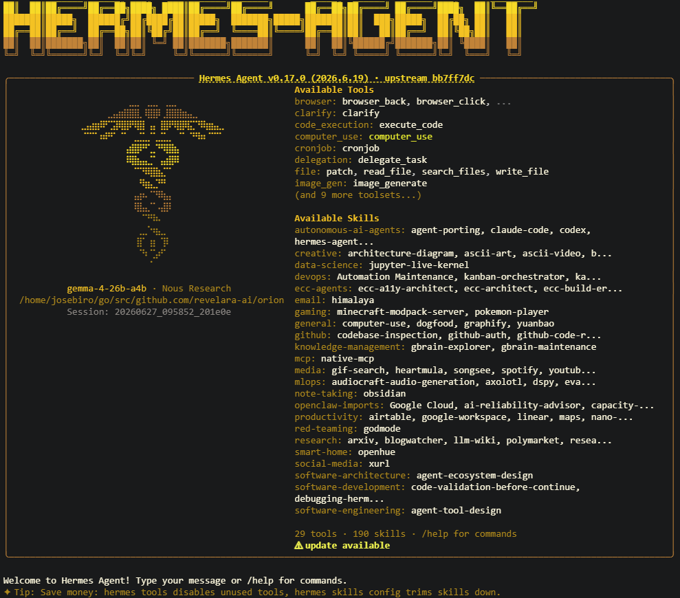

# Orion

**A reliability-first, local-first agentic development harness with a strongly opinionated view of proof and validation.**

Orion drives coding agents from a developer's intent to working software, and treats output as **done only when its correctness has been independently proven — never merely asserted.** It is the reliability layer of the agentic software development lifecycle.

> One sentence: *type what you want to build; Orion makes the intent unambiguous, coordinates agents to build it, and only calls it done when behavioral, empirical, and hazard proof converge — then hands you software you can actually operate at 3 a.m.*



## Why Orion exists

Agentic coding tools write code faster than anyone can review it — and quietly degrade reliability: they game their own tests, drift from intent over long runs, emit uninstrumented code, hallucinate dependencies, and leave no author to page when it breaks. The development loop was built for humans; agents break its assumptions in silent, compounding ways.

Orion is a new loop built on one bet: **reliability belongs to the harness, not the model.** Like microservices delivering reliable systems on commodity hardware, Orion produces reliable software on top of fallible, commodity code-generation models — by putting the guarantees in the loop (independent proof, bounded steps, embedded SRE knowledge), not in any single model.

The credibility hinge — and Orion's central rule — is that **no agent grades its own homework**: the agent that generates code is structurally separated from the mechanism that proves it, and proof is, wherever possible, a *deterministic tool* (a shell check, a probe, a test) rather than another LLM's opinion. (Google SRE independently mandates the same "independent harnesses" — see the manifesto's External Corroboration.)

## How it works (the loop)

```
intent ─▶ completeness gate ─▶ executable spec ─▶ decompose (Epic/Tasks)
   ─▶ agents build (sandboxed, one git worktree per task)
   ─▶ multi-modal proof: behavioral (tests + mutation) · empirical (run it, probe it) · hazard (STPA)
   ─▶ deployment bar ─▶ deliver (proof earns the right to ship)
   ─▶ learn (reliability knowledge in, observed failure modes out)
```

The developer converses with a single orchestrator — the **Conductor** — through a TUI. Behind it, Orion solves the hard problems: efficient agent coordination, context/memory management (countering erosion), durable task tracking, and independent multi-modal proof as the completion criterion.

## Install

```bash
git clone https://github.com/revelara-ai/orion.git
cd orion
make build            # → bin/orion
make install          # → ~/.local/bin/orion
```

Prerequisites:

- **Go** — the version in [`go.mod`](go.mod).
- **git ≥ 2.28** — the managed-repo foundation (`internal/repo`) uses `git init -b main` and clone default-branch behavior, both introduced in 2.28.
- **bubblewrap (`bwrap`), Linux only** — the generation/proof sandbox (scoped workdir, no network, no host filesystem). Without it Orion falls back to an **unsandboxed** backend and says so; treat that mode as trusted-input-only. On Ubuntu 24.04+ you may need `sudo sysctl -w kernel.apparmor_restrict_unprivileged_userns=0` (AppArmor blocks unprivileged user namespaces by default).

## Quickstart

```bash
# 1. Give Orion a model (any one of these):
export ANTHROPIC_API_KEY=...        # Anthropic (default provider)
export GEMINI_API_KEY=...           # or Gemini — select with ORION_MODEL=gemini/<model>
# or a local OpenAI-compatible server (Ollama / LM Studio) via ~/.orion/config.yaml

# 2. Check the install — 'fail' breaks the exit code, 'warn' is advisory:
orion doctor

# 3a. Interactive: the TUI grills your intent to a ratified spec, then builds and proves.
orion

# 3b. Headless: submit an intent, then run the build+prove pipeline.
echo "an HTTP service that returns the current time as JSON" | orion submit --non-interactive
orion run

# Brownfield: prove a change against an existing repo (worktree + regression gate).
orion change "add a 5s timeout to the outbound HTTP call in fetchStatus"
```

The optional **revelara.ai** connection (reliability controls, incident knowledge, risk register) enriches specs and adds corpus-sourced reliability checks; without it `orion doctor` reports an advisory *warn* and the core loop runs fully offline.

## Start here

| Document | What it is |
|---|---|
| [docs/MANIFESTO.md](docs/MANIFESTO.md) | The vision and the beliefs — the source of truth everything inherits from. |
| [docs/PRD/orion-v3.md](docs/PRD/orion-v3.md) | The current product direction (the Anchored Module Pipeline). |
| [docs/PRD/orion-v2.md](docs/PRD/orion-v2.md) | The V2 spec — the proven spine V3 evolves (kept as the migration oracle). |
| [docs/INDEX.md](docs/INDEX.md) | Master index of all design docs. |
| [docs/SPEC/](docs/SPEC/) | Component specs: proof triad reconciliation, worktree/git handling, module proposer. |
| [docs/research/](docs/research/) | Research feeding the design (harness-reliability, Google SRE practices, …). |

## Status

Early and moving fast. The **V2.0 spine is proven end-to-end** (idea → ratified spec → decomposed plan → sandboxed generation → 3-mode proof → delivery with runbook), and **V3** — semantic decomposition, per-module alignment gates, design-time formal verification — is landing incrementally ([docs/PRD/orion-v3.md](docs/PRD/orion-v3.md)). The North-Star acceptance harness (`test/acceptance`) encodes the full target as 56 executable predicates; some stay red by design until their surfaces are built. Brownfield changes (`orion change`) work today; polyglot generation and earned autonomy are phased next.

## Stack

Go · hand-rolled CLI + [bubbletea](https://github.com/charmbracelet/bubbletea) TUI · SQLite in WAL mode (the Context Store — durable source of truth with a DB-enforced done-gate) · pure-Go semantic memory (GoMLX + ONNX `bge-base` embeddings, brute-force cosine — no CGO, no external services) · [bubblewrap](https://github.com/containers/bubblewrap) namespace sandboxing (pluggable; a stronger backend like gVisor can slot in later) · [FizzBee](https://fizzbee.io) design-time model checking · Agent Client Protocol (ACP) for driving vendor coding agents. Local-first; the one optional cloud dependency is the **revelara.ai** reliability platform.

## Contributing & security

See [CONTRIBUTING.md](CONTRIBUTING.md) (including the proof-gated doctrine and the tracker policy) and [SECURITY.md](SECURITY.md) (the sandbox threat model, stated honestly).

## License

Orion is licensed under the [Apache License 2.0](LICENSE). Copyright 2026 Revelara AI.

The optional local embedding model ([bge-base-en-v1.5](https://huggingface.co/BAAI/bge-base-en-v1.5), BAAI) is MIT-licensed and downloaded separately — it is not distributed with this repository.

---

*The problem is not the model. The problem is that the development loop hasn't caught up. Orion is the loop that has — and the proof is the right to ship.*
